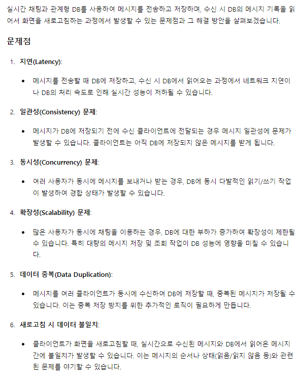
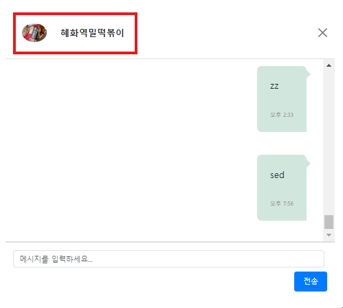
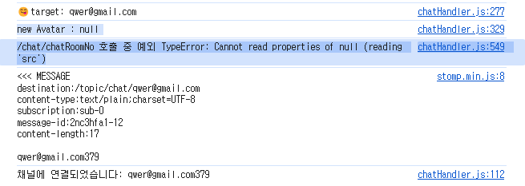
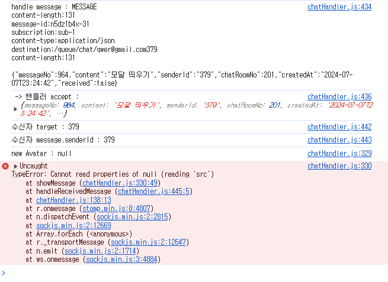
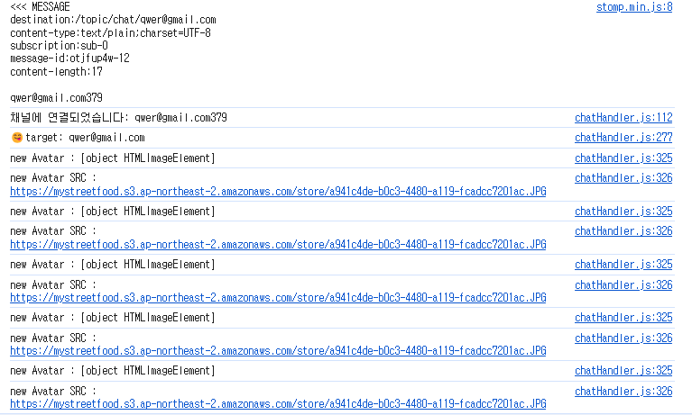
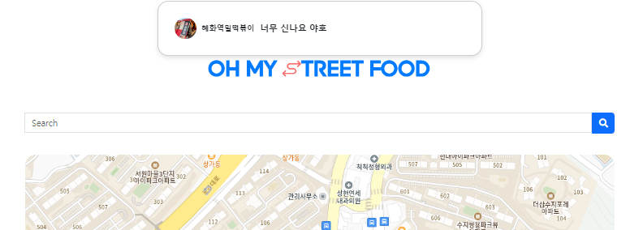
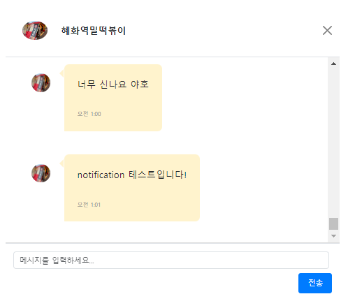

### 채팅기록 조회가 가능한 실시간 1 대 1 채팅 서비스 구현 

#### 웹 소켓 기초 
> 📌 `GPT 예제` or `구글 레퍼런스`  
> `채팅방 입장` 버튼에 특정 주소를 지정 `ex) randomChatRoom-001`
> 버튼을 누르면 `stompClient` 가 해당 주소를 `subscribe` 하도록 함
 
> 💡 지금 접속한 client 의 `WebSocketSession` 이 무엇인지 알 필요가 없다. 
> `abceed1` 이든 `p2fdkjcs` 이든 상관없이 하나의 채널 주소를 제공하고, `stomp` 가  해당 채널 주소를 `subscribe` 하게 만들면 끝 

#### 1 대 1 private 채팅방
> 📌 사장과 고객이 1대1 대화를 나눌 수 있어야 한다.
> `webSocketSession`을 특정 `sessionId` 로 관리가 필요.  
> -> 로그인시 principal 객체를 활용하여 principal.name 을 `subscribe` 하도록 하였음.   
> -> 해당 `principal.name` 의 `role` 이 `owner` 일 경우 `storeNo` 모두 `subscribe` 처리  
> 예시) user("qwer@gmail.com") 한 개의 채널을 가지고 시작 / owner("357", "146", "283", "199") 4개의 채널을 가지고 시작  
> 구독한 location 에서 새로운 채널명을 수신 했을 때 새롭게 구독 처리할 수 있도록 콜백 함수에 subscribe 처리   
> principal 객체와 storeNo 를 활용하여 동적으로 새로운 채팅 주소 할당 `ex)qwer@gmail.com283`   
> 메세지 브로커(StompHandler) 에 새롭게 만들어진 채팅 주소 전달  
> StompHandler 는 전달받은 채팅 주소를 고객과 해당가게를 소유한 owner 에게 전달함  
> ex)고객 (qwer@gmail.com, qwer@gmail.com283) / 사장 (283, qwer@gmail.com283)   
> -> 여기서 qwer@gmail.com 과 283 은 수신자, qwer@gmail.com283 는 `payload` 가 된다.   
> qwer@gmail.com 과 283 은 콜백 함수를 통해 전달받은 채널명을 구독하게 됨  

#### 채팅 기록 조회 
> 📌 `UserA` 가 접속했을 때, 특정 채팅방 에서 채팅했던 기록을 조회할 수 있어야한다.    
> 동적으로 새로운 채팅 주소를 할당 했을 때, 해당 주소를 DB 에 저장 // ex)qwer@gmail.com283   
> 메세지를 send 하는 과정에서 senderId, content, chatRoomNo 를 저장   
> chatRoomModal 을 띄울때만 DB 에서 채팅기록을 읽어서 화면에 출력 / 나머지는 불러온 기록에 JSON 으로 HTML 태그안에 추가해줘야함   
> -> 기존 CRUD 처럼 처리하면 ? (send 하면 create , receive 하면 read)    
>   
> 절대 실시간으로 Create 하면서 Read 하려고 하지말자 

#### 실시간 알람 
> 📌 `UserA`가 접속했을 때, 채팅방 접속 버튼을 누르지 않아도 자동으로 기존 채팅방들 주소에 접속할 수 있어야 한다.  
> 새로운 채팅 주소를 할당 했을 때 저장한 주소 목록을 불러와서 `subscribe` 처리 ->   
> 너무 많은 불필요한 `subscribe` 가 이루어짐    
> 예를들어 가게가 5개인 사장이 로그인 -> 각 가게와 채팅을 한 손님의 수 10 -> 50번의 subscribe 가 일어남   
> 페이지를 이동할 때, 새로고침 할 때마다 새롭게 `subscribe` 함 (`WebSocket` 특성)  
> -> `SessionConnectEvent` `class`를 사용해서 접속 유저의 고유 Address 를 저장하고, 상대방이 없는 `subscribe` 는 하지 않도록 처리  
> 동시성 이슈를 해결하기 위해 `ConcurrentHashMap` 사용 (동시에 읽기는 가능하지만 쓰기는 제한해서 동시성 이슈를 피함)  
> user 가 접속하면 해당 username 을 해쉬맵에 저장 / owner 가 저장하면 storeNo 를 해쉬맵에 저장   
> `subscribe` 요청시 `ConcurrentHashMap`에서 구독 상대방을 찾음 & 있으면 `subscribe` 없다면 `subscribe` 요청 무시함   
> // 리팩토링 해야함 -> 아예 send 요청조차 안날아가게  


#### 중복 구독 처리 고민 
> 📌 동일 주소에 대한 구독 요청 처리
> * case 1
> 특정 `user` 가 `사장님과 채팅하기` 버튼을 계속 누를 경우   
> `stompClient`는 해당 요청을 별개의 Id 를 부여하여 관리하지만 메세지를 별개의 Id로 수신하는 기능은 없다.  
> 즉 3번 구독하고 하나의 메세지를 보내고 받으면 3번 발신하고 , 3번 수신한다  
> * case 2  
> 연결 상대방의 뒤늦은 접속으로 인한 중복 구독   
> `userA` 가 사장님과 채팅하기를 눌러서 해당 채널을 구독 //ex) `qwer@gmail.com283`  
> `283` store 의 owner 가 로그인   
> `ConcurrentHashMap` 에 `UserA` 와 `283` 둘 다 존재하기 때문에 `stompClient` 는 `UserA` 와 `283 store owner`   
> 모두에게 `qwer@gmail.com283` 주소를 전달하여 구독하게 만듬   
> -> `owner` 는 상관없지만 `UserA` 는 이미 구독한 `qwer@gmail.com283` 채널을 뒤늦게 들어온 `owner` 때문에 한번 더 구독하게 됨  
> 자바스크립트 파일에 `let subscribedChannels = {};`  을 통해 `key : value` 형태로 이미 구독한 채널을 관리   
> ```javascript
> {
>    '채널이름1': true,  // 채널1이 구독된 상태
>    '채널이름2': false, // 채널2가 구독되지 않은 상태
>    '채널이름3': true   // 채널3이 구독된 상태
> }
> ```

### message 사진 처리 로직 고민 

> 📌 기존 방식 
> ```javascript
> stompClient.send('/app/chat/sendRequest', {}, JSON.stringify({
>        content: content,
>        senderId: address,
>        chatRoomNo: data
>    }))
> ```
> 💡 메세지 브로커에게 내용, 보낸사람Id, chatRoomNo 를 보낸다. 

### 1. 현재 처리하는 방식(chatModal 의 chat-avatar 이미지 사용) 

>  
>  
> 📌 채팅 모달 상단의 chat-avatar 이미지를 사용
> ```javascript
> let avatarImg = document.querySelector("#chat-avatar");
> messageElement.innerHTML = `
>            <div class="chat-avatar">
>            
>            </div>
>            <div class="message-content">
>            <div>${message.content}</div>
>            <div class="chat-time"></div>
>            </div>
>        `;
> ```
> 
#### 1-1. 문제점 

> 📌 항상 `chatRoomModal` 이 먼저 생성되는 경우만 있는게 아니다    
> #### * case 1
> 
> #### * case 2
> 
> 💡 case 1 과 case 2 모두 `avatarImg = document.querySelector("#chat-avatar");`
> 값이 `null` 인걸 확인할 수 있었다.   
> 즉 저 시점에서 `avatarImg` 는 값이 배정되지 않는다.

###### case 1
> 📌 case 1 예상 
> 1. `openChatRoomMyPage(message, myAddress)` ->   
> 2. `connectToChannelWithOutLoginCheck((customer + storeNo), myAddress)` ,  
> `connectModalToChatRoom(message.chatroomNo, data, myAddress)` ->  
> 3. `showChatRoom(messages, subscription, address)`  
> 4. `chatroomTitle(identifier)` , `showMessage(message, address)`  
>   
> 분명 javascript 는 절차적 프로그래밍 언어이고,  `showChatRoom` 의 코드 흐름상   
> `chatroomTitle` 이 먼저 지정되고 그 후 `showMessage` 함수 내에서   
> 지정된 `chatroomTitle`에서 지정한 `document.querySelector("#chat-avatar img")` 에 접근하도록   
> 되어있는데 , 어째서 `null` 값이 들어오는걸까 ?   

> 💡 자바스크립트의 비동기 특성  
> 자바 스크립트와 같은 절차적 프로그래밍에선 일반적으로 코드가 위에서 아래로 실행되지만,   
> 자바 스크립트의 비동기적 특성 때문에 코드의 실행 순서가 예상과 다를 수 있다.   
> 특히, 비동기 함수나 콜백 함수가 있을 때 이런 특징이 더욱 두드러질 수 있다.   
>   
> 자바스크립트의 비동기 프로그래밍에는 `setTimeout`, `setInterval`, `AJAX 요청`, `Promise`,  
> `async/await` 등의 기능이 포함된다.   
> 이러한 비동기 작업들은 코드의 일부분을 나중에 실행되도록 예약한다. 이러한 작업 때문에   
> 코드는 때때로 예상과 다른 순서로 실행될 수 있다.   
>   
> `case 1`의 경우도 마찬가지이다. `document.querySelector("#chat-avatar img")`가   
> `null`을 반환하는 이유는 자바스크립트의 비동기적 특성 때문일 가능성이 크다.   
> 특히 이미지를 설정하는 `chatroomTitle` 함수는 비동기 `fetch` 호출을 수행하기 때문에  
> 이 호출이 완료되기 전에 `showMessage` 함수가 이미지 요소에 접근하려한다면   
> 해당 요소가 아직 DOM 에 존재하지 않기 때문에 `null` 을 반환하게 되는것이다.   

##### 해결법?   
##### 1.  
> 📌 `showChatRoom` 함수가 `chatRoomTitle` 가 완료될 때까지 기다리도록 만든다.  
> 일단 `chatRoomTitle` 함수가 `promise`를 반환하도록 수정한다.   
> ```javascript  
> function chatroomTitle(identifier){  
>    return fetch("/chat/getDisPlayName?identifier=" + identifier)  
>        .then(response=>response.json())  
>        .then(data=>{  
>            document.getElementById("chatRoomModalLabel").innerText = data.displayName;  
>            document.getElementById("chat-avatar").innerHTML = ``;  
>        })  
> }  
> ```  
> -> `promise` 를 반환하도록 수정된 `chatroomTitle` 함수  
>   
> ```javascript  
> chatroomTitle(identifier).then(()=>{  
>        console.log("😋target: " + address);  
>        var chatMessagesContainer = document.getElementById('chat-messages');  
>        chatMessagesContainer.innerHTML = ''; // 초기화  
>        messages.forEach(function (message) {  
>            showMessage(message, address);  
>        });  
>    });  
> ```  
> ->  `showChatRoom` 함수도 `chatroomTitle`함수가 실행되고나서 `showMessage` 함수가 실행되도록 수정한다.   

##### 결과   
  
> 📌 DOM 에 img 가 지정되고, 해당 img 에 접근할 수 있다.   

##### 문제점 1-2   
> 📌 `case 2` 의 경우는 ?   
> `case 2`와 같은 경우 위와 같은 방법을 시도하여도 해결할 수 없다.   
> 
> -> 아닌데 ? 이것도 title 먼저 부르고 then 처리해주면 되지 않을까?  


#### 결론  
> 이것도 된다.   
> ```javascript  
> function handleReceivedMessage(message, channel, address) {  
>   console.log("handle message : " + message)  
>    const messageBody = JSON.parse(message.body);  
>    console.log(" -> 핸들러 accept : ", messageBody);  
>    const match = channel.match(/(.*?)(\d+)$/);  
>    const customer = match[1];  
>    const storeNo = match[2];  
>  
>    const target = (customer === messageBody.senderId) ? customer : storeNo;  
>  
>    //showMessage(messageBody, address);  
>
>    let identifier = address === customer ? storeNo : customer;  
>    //chatRoomTitle을  address 로 변경 -> address = !address 와 동일하게 변경  
>    chatroomTitle(identifier).then(() => {  
>        console.log("😋handleReceivedMessage Target : " + address);  
>        console.log("수신자 message.senderId : " + messageBody.senderId);  
>        showMessage(messageBody, address);  
>        // 여기선 초기화가 필요없지않나?  
>  
>        // 모달 창 활성화 확인    
>        let chatRoomModal = document.getElementById('chatRoomModal');  
>        let isModalShown = chatRoomModal.classList.contains('show');  
>        if (!isModalShown) {  
>            showNotification(messageBody);  
>        }  
>    });  
>    loadChatRooms()  
> }  
>      
> ```  
> `handleReceivedMessage` 함수 역시 먼저 `chatroomTitle` 함수를 통해   
> `DOM` 에다 `img src` 를 세팅해놓고 호출하니 아무 문제 없이 작동하는것을 확인하였다.    
  
  
> 💡 `Notification`에서의 모습  
  
  
> `notiToChatModal` : 알람창을 통해 ChatModal 로의 접근도 확인   
  
### 💡 추가 리팩토링 요소     
> 현재 `document.querySelector("#chat-avatar img")` 는 `showMessage` 함수 내에서 호출되고 있다.     
> showMessage 가 100번 호출되면 DOM 요소에 100번 접근하게 되는데 , 성능적인 요소에서도 별로 좋지 않은듯 하다.   

#### 📌 함수 수정  
```javascript  
//function showChatRoom  
chatroomTitle(identifier).then(() => {  
        console.log("😋target: " + address);  
        var chatMessagesContainer = document.getElementById('chat-messages');  
        chatMessagesContainer.innerHTML = ''; // 초기화  
        let avatarImg = document.querySelector("#chat-avatar img"); // showMessage 보다 상위 함수에서 전달  
        messages.forEach(function (message) {  
            showMessage(message, address, avatarImg);  
        });  
    });  
```  
  
```javascript  
function showMessage(message, sender, avatarImg);  
    // let avatarImg = document.querySelector("#chat-avatar img"); -> DOM 요소에 접근하지 않도록 한다.  
```  

```javascript  
// 여기도 수정   
function handleReceivedMessage(message, channel, address) {  
    console.log("handle message : " + message)  
    const messageBody = JSON.parse(message.body);  
    console.log(" -> 핸들러 accept : ", messageBody);  
    const match = channel.match(/(.*?)(\d+)$/);  
    const customer = match[1];  
    const storeNo = match[2];  
  
    const target = (customer === messageBody.senderId) ? customer : storeNo;  
  
    //showMessage(messageBody, address);  
  
    let identifier = address === customer ? storeNo : customer;  
    //chatRoomTitle을  address 로 변경 -> address = !address 와 동일하게 변경  
    chatroomTitle(identifier).then(() => {  
        console.log("😋handleReceivedMessage Target : " + address);  
        console.log("수신자 message.senderId : " + messageBody.senderId);  
        let avatarImg = document.querySelector("#chat-avatar img");  
        showMessage(messageBody, address, avatarImg);  
        // 여기선 초기화가 필요없지않나?  
  
        // 모달 창 활성화 확인  
        let chatRoomModal = document.getElementById('chatRoomModal');  
        let isModalShown = chatRoomModal.classList.contains('show');  
        if (!isModalShown) {  
            showNotification(messageBody);  
        }  
    });  
    loadChatRooms()  
}  
```  
